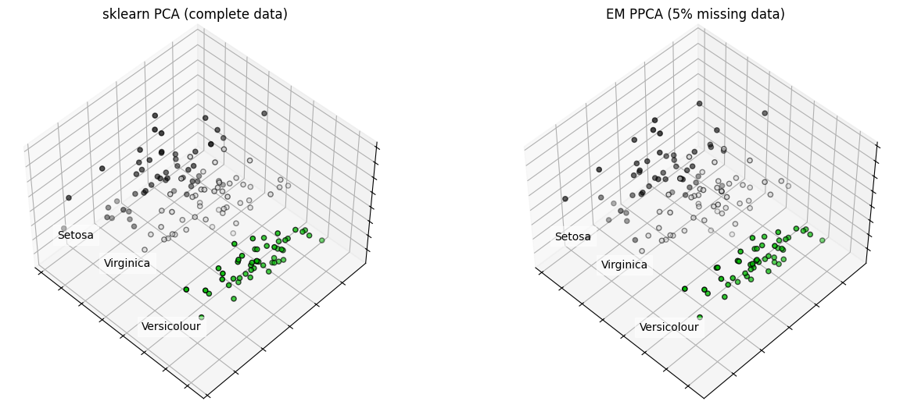

# Probabilistic PCA (PPCA) in Python

## Missing values? No problem!

PPCA is a probabilistic latent variable model, whose maximum likelihood solution corresponds to PCA. For an introduction to PPCA, see [1].

This implementation uses the expectation-maximization (EM) algorithm to find maximum-likelihood estimates of the PPCA model parameters. This enables a principled handling of missing values in the dataset, assuming that the values are missing at random (see equations further below).

## Requirements

This implementation requires Python >= 3.9 and can be installed as a package with:
```
pip install -e .
```

To run the `demo.ipynb` notebook, the following packages are additionally required:
```
pip install notebook scikit-learn matplotlib
```

## Demo



In the `demo.ipynb` we show basic usage and compare this implementation to the `sklearn` implementation. In short, PPCA can be used similarly to its `sklearn` counterpart:
```
from ppca import PPCA
...
ppca = PPCA(n_components=2)
# X contains data with possibly missing values (= np.nan)
# Z are the transformed values
Z = ppca.fit_transform(X)
print("explained variance: ", ppca.explained_variance_)
...
```

However, in addition to the `sklearn` implementation, PPCA can output distributions, handle missing values, etc.

## EM for PPCA with Missing Values

Most implementations on Github for PCA with missing values use the EM imputation algorithm described in Roweis [3]. However, without formulating a probabilistic model, there is e.g. no obvious way to transform unseen data with missing values. Instead, in this repository, we implement the full probabilistic PCA model.

References [1] and [2] provide derivations and detailed discussions of the model and its optimization with EM, however, the missing value case is not explained in detail. Therefore, the necessary equations are provided here in compact form. Familiarity with [1] and [2] is assumed.

First, note that we can simply integrate out missing values from the marginal likelihood. Let $\mathbf{x}_n^\text{m}$ denote the missing entries of observation $\mathbf{x}_n$ and $\mathbf{x}_n^\text{o}$ the observed entries.

$ p(\mathbf{X}|\mathbf{\mu}, \mathbf{W}, \sigma^2) \\
= \prod_{n=1}^N \int p(\mathbf{z}_n) p(\mathbf{x}_n | \mathbf{z}_n, \mathbf{\mu}, \mathbf{W}, \sigma^2) \text{d}\mathbf{z}_n \\
= \prod_{n=1}^N \int p(\mathbf{z}_n) \prod_{x_{ni} \in \mathbf{x}_n^\text{o}} \mathcal{N}(x_{ni}|\mathbf{w}_i^\text{T} \mathbf{z}_n + \mu_i, \sigma^2) \int \prod_{x_{nj} \in \mathbf{x}_n^\text{m}} \mathcal{N}(x_{nj} | \mathbf{w}_j^\text{T} \mathbf{z}_n + \mu_j, \sigma^2) \text{d}\mathbf{x}_n^\text{m} \text{d}\mathbf{z}_n \\
= \prod_{n=1}^N p(\mathbf{x}_n^\text{o}|\mathbf{\mu}, \mathbf{W}, \sigma^2) $

Note that $\mathbf{w}_i^\text{T}$ is the $i$-th row of $\mathbf{W}$. From this equation we can already see that the maximum likelihood estimate of $\mathbf{\mu}$ is given by:

$ \mathbf{\mu}_{\text{ML}} = \frac{1}{\sum_{m=1}^N \iota_{mi}} \sum_{n=1}^N\iota_{ni} x_{ni}$

$\iota_{ni}$ are indicator variables which are 1 if $x_{ni}$ is observed and 0 otherwise. Estimating $\mathbf{W}_{\text{ML}}$ and $\sigma_{\text{ML}}^2$ is more complicated and we have to resort to the EM algorithm.

The expectation of the complete-data log likelihood w.r.t. the latent variables is as follows:

$ \mathbb{E} [\text{ln } p(\mathbf{X}, \mathbf{Z} | \mathbf{\mu}, \mathbf{W}, \sigma^2)] \\
= \mathbb{E} [\sum_{n=1}^N \{ \text{ln }p(\mathbf{z}_n) + \sum_{i=1}^D \iota_{ni} \text{ln } \mathcal{N} (\mathbf{x}_{ni} | \mathbf{w}_i^\text{T} \mathbf{z}_n + \mu_i, \sigma^2)\}] \\
= -\sum_{n=1}^N \{ \frac{M}{2} \text{ln }(2\pi) + \frac{1}{2} \text{Tr}(\mathbb{E}[\mathbf{z}_n \mathbf{z}_n^\text{T}]) + \sum_{i=1}^D \iota_{ni} \{ \frac{1}{2} \text{ln }(2\pi\sigma^2) + \frac{1}{2\sigma^2}(x_{ni} - \mu_i)^2 - \frac{1}{\sigma^2}\mathbb{E}[\mathbf{z}_n]^\text{T} \mathbf{w}_i (x_{ni} - \mu_i) + \frac{1}{2\sigma^2} \text{Tr}(\mathbb{E}[\mathbf{z}_n \mathbf{z}_n^\text{T}] \mathbf{w}_i \mathbf{w}_i^\text{T})\} \} $

In the E-step, we estimate the sufficient statistics of the latent posterior:

$ \mathbb{E} [\mathbf{z}_n] = \mathbf{M}_n^{-1} \mathbf{W}_n^\text{T} \mathbf{y}_n \\
\mathbb{E} [\mathbf{z}_n \mathbf{z}_n^\text{T}] = \sigma^2 \mathbf{M}_n^{-1} + \mathbb{E}[\mathbf{z}_n] \mathbb{E}[\mathbf{z}_n]^\text{T}$

where $\mathbf{y}_n$ contains the observed elements of $\mathbf{x}_n$ minus the corresponding elements of $\mathbf{\mu}_\text{ML}$, $\mathbf{W}_n$ is the matrix formed by the rows of $\mathbf{W}$ corresponding to observed elements in $\mathbf{x}_n$, and $\mathbf{M}_n = \mathbf{W}_n^\text{T} \mathbf{W}_n + \sigma^2 \mathbf{I}$.

In the M-step, we maximize the complete-data log likelihood while fixing the latent variable posterior.

$ \mathbf{W}_\text{new} = [\sum_{n=1}^N \mathbf{y}_n \mathbb{E}[\mathbf{z}_n]^\text{T}] [\sum_{n=1}^N \mathbb{E}[\mathbf{z}_n \mathbf{z}_n^\text{T}]]^{-1} $

$ \sigma^2_\text{new} = \frac{1}{\sum_{n=1}^N \sum_{i=1}^D \iota_{ni}} \sum_{n=1}^N \sum_{i=1}^D \iota_{ni} \{ (x_{ni} - \mu_{\text{ML}, i})^2 - 2 \mathbb{E}[\mathbf{z}_n]^\text{T} \mathbf{w}_i^\text{new} (x_{ni} - \mu_{\text{ML}, i}) + \text{Tr}(\mathbb{E}[\mathbf{z}_n \mathbf{z}_n^\text{T}] \mathbf{w}_i^\text{new} (\mathbf{w}_i^\text{new})^\text{T}) \}$ 
## References

[1] Bishop, C. M., Pattern Recognition and Machine Learning. New York: Springer, 2006.

[2] Tipping, M. E. and Bishop, C. M., Probabilistic Principal Component Analysis. Journal of the Royal Statistical Society: Series B (Statistical Methodology), 1999.

[3] Roweis, S., EM algorithms for PCA and SPCA. In Proceedings of the 1997 conference on Advances in neural information processing systems 10 (NIPS '97), 1998, 626-632.
